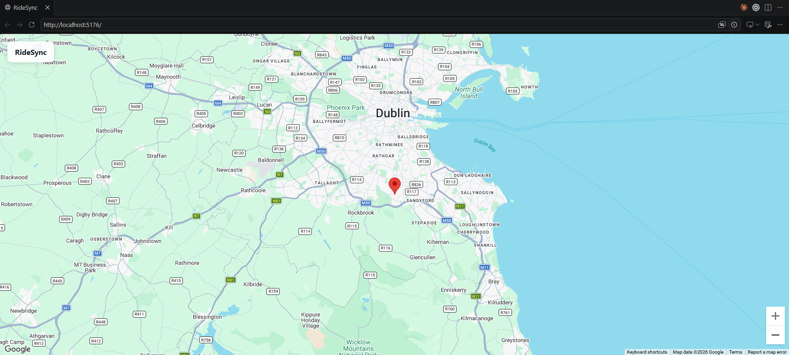

# RideSync

RideSync is a real-time group ride tracking application. This repository is organised as a small monorepo so the web client and API can evolve independently while sharing one development workflow.

## Structure

- `frontend/` — React, Vite, and TypeScript web application.
- `backend/` — FastAPI service.
- `docker-compose.yml` — local multi-service development environment.

## Prerequisites

- Node.js 20+
- Python 3.12+
- Docker Desktop (optional, for containerised development)

## Run locally

Start the frontend:

```bash
cd frontend
npm install
npm run dev
```

The frontend is served at `http://localhost:5176` by default.

Before starting it, copy `.env.example` to `.env` and set the Google Maps values. Create a browser key in Google Cloud, enable the **Maps JavaScript API**, and restrict the key to your development and production HTTP referrers. Create and provide a Google Maps Map ID; it is required for the modern Advanced Marker used for the current-location pin.

In a second terminal, start the backend:

```bash
cd backend
python -m venv .venv
.venv\\Scripts\\activate
pip install -e .[dev]
uvicorn app.main:app --reload --host 0.0.0.0 --port 8000
```

The API liveness endpoint is available at `http://localhost:8000/health`. Backend settings are read from environment variables. For local browser access, set `BACKEND_CORS_ORIGINS` to a comma-separated list of permitted frontend origins; production deployments should use only their explicit HTTPS origins.

Alternatively, copy `.env.example` to `.env` and run:

```bash
docker compose up --build
```

## Milestone status

Milestone 4 adds the initial ride-session workflow: riders can create a session, join it with a display name, and leave it through the React client and versioned FastAPI endpoints. Session state is intentionally in-memory only; database persistence, real-time location sharing, and WebSockets have not yet been implemented.

## Progress

### Milestone 3 — Google Maps location view

The frontend displays a full-screen Google Map, requests browser geolocation, and marks the rider's current location.


